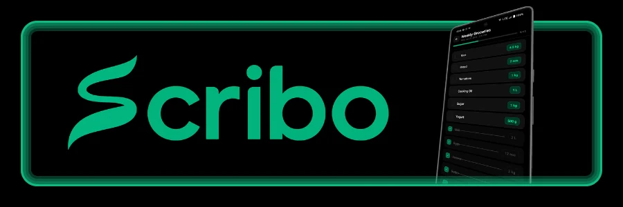

# Scribo



A personal shopping list app built with Expo and React Native. Scribo lets you maintain a master list of everything you regularly stock, track what you currently have, generate a shopping list for what's missing, and check off items while you shop.

## Features

- **Master lists** — Create named lists (e.g. "Weekly Groceries", "Monthly Stock") and add items with quantity, unit, and optional notes. Autocomplete suggests previously entered item names.
- **Generate shopping list** — Enter your current stock quantities for each item, add any one-off extra items, then generate a trip-specific shopping list of only what you need.
- **Track while shopping** — Check off items as you buy them. Tap a quantity badge to do a partial buy — enter how much you actually got and the app splits it automatically: the bought portion is marked as checked, and the remaining quantity stays on the list for next time. Quantities are converted across compatible units (e.g. you needed 1 kg, you got 600 g — remaining shows as 400 g).
- **Unit conversion** — Weight (g, kg), volume (mL, L), and count (nos, pcs, dozen) families with automatic conversion when quantities are compared or split.
- **Export / import** — Back up all your lists and data as a JSON file and share it anywhere (Files, Drive, WhatsApp, etc.). Import it back on any device to restore everything. Useful for transferring to a new phone or sharing a list setup with someone else.
- **Dark / light theme** — Follows system preference by default; can be overridden in settings. Emerald green accent color.
- **Malayalam support** — Item names in Malayalam render in the Chilanka handwriting font; Latin text uses Comic Neue.

## Tech Stack

| | |
|---|---|
| Framework | Expo SDK 56 (React Native 0.85) |
| Architecture | New Architecture (Fabric + JSI) enabled |
| Navigation | React Navigation v7 (native stack) |
| Animations | React Native Reanimated 4 |
| Gestures | React Native Gesture Handler |
| Keyboard | react-native-keyboard-controller (edge-to-edge Android 12+) |
| Storage | AsyncStorage (local only, no backend) |
| Build | EAS Build (cloud) |

## Project Structure

```
src/
├── screens/          # One file per screen
│   ├── HomeScreen.tsx
│   ├── MasterListScreen.tsx       # Add/edit/reorder master items
│   ├── StockEntryScreen.tsx       # Enter stock levels → generate list
│   ├── ShoppingListsScreen.tsx    # Past generated lists
│   ├── ShoppingListDetailScreen.tsx  # Track/check off items
│   ├── SettingsScreen.tsx
│   └── AutocompleteHistoryScreen.tsx
├── components/       # Shared UI components
├── context/          # AppContext (state + storage), ThemeContext
├── storage/          # AsyncStorage read/write per data type
├── utils/            # Unit conversion, list generation logic
├── hooks/            # useColorScheme (theme access)
├── navigation/       # Stack navigator setup
└── types/            # Shared TypeScript types
```

## Getting Started

**Prerequisites:** Node.js, Expo CLI, and (for device testing) the Expo Go app or a local Android/iOS build.

```bash
npm install
npx expo start
```

Scan the QR code with Expo Go, or press `a` for Android emulator / `i` for iOS simulator.

> **Note:** Keyboard behavior on Android (edge-to-edge, 3-button nav) requires a real APK build — Expo Go uses its own AndroidManifest and won't reflect these settings.

## Building

```bash
# Preview APK (for testing / sharing)
eas build --profile preview --platform android

# Production AAB (for Play Store)
eas build --profile production --platform android
```

## Data Storage

All data is stored locally on device using AsyncStorage. There is no account, no sync, and no server. Uninstalling the app clears all data.

| Key | Contents |
|---|---|
| `@shopping_lists_v1` | Master lists and their items |
| `@list_items_v1_{listId}` | Generated shopping list items |
| `@autocomplete_history_v1` | Item name history for suggestions |
